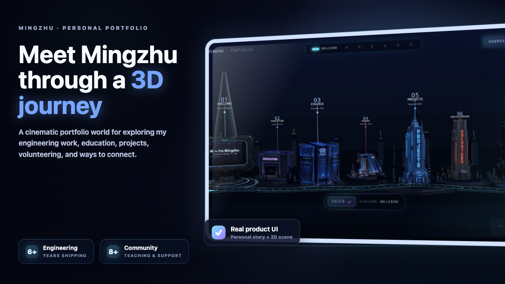
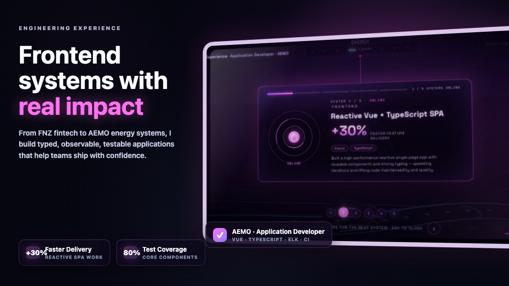
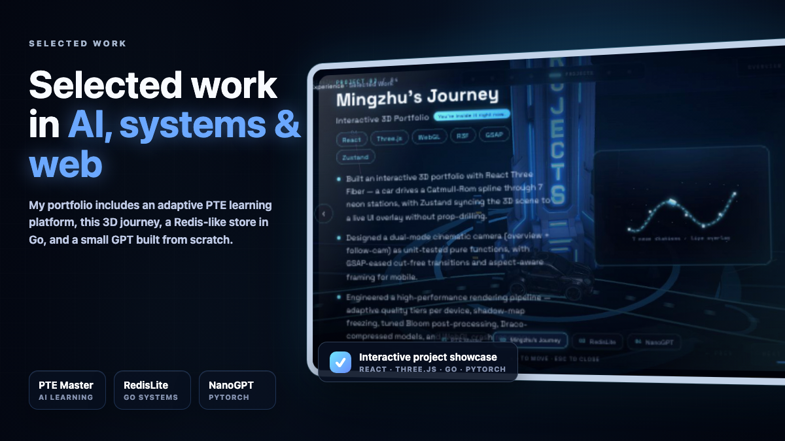
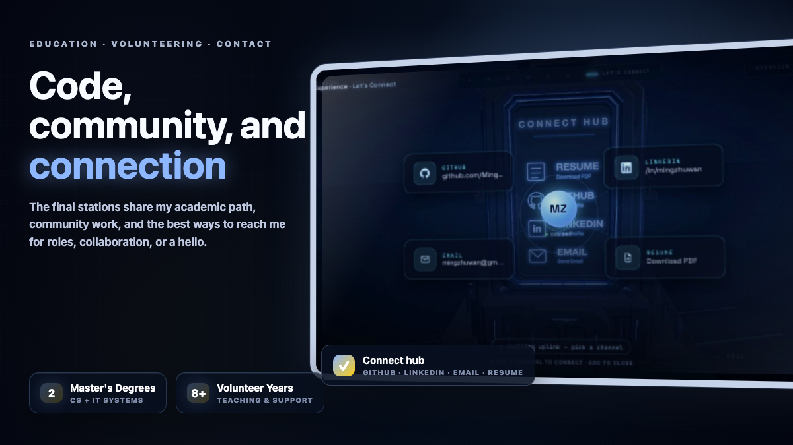

<!-- Improved compatibility of back to top link: See: https://github.com/othneildrew/Best-README-Template/pull/73 -->
<a id="readme-top"></a>

<!-- PROJECT HEADER -->
<br />
<div align="center">

<h3 align="center">Interactive Portfolio Diorama</h3>

  <p align="center">
    A cinematic 3D personal portfolio where a small car drives through seven neon stations &mdash; introducing my engineering experience, selected projects, education, volunteering, and ways to connect.
  </p>
</div>

<p align="center">
  
</p>


<!-- TABLE OF CONTENTS -->
<details>
  <summary>Table of Contents</summary>
  <ol>
    <li><a href="#about-the-project">About The Project</a></li>
    <li><a href="#architecture">Architecture</a></li>
    <li><a href="#getting-started">Getting Started</a></li>
    <li><a href="#usage">Usage</a></li>
    <li><a href="#contributing">Contributing</a></li>
    <li><a href="#license">License</a></li>
  </ol>
</details>


<!-- ABOUT THE PROJECT -->
## About The Project

Most portfolio sites are static scroll pages. **Interactive Portfolio Diorama** turns my portfolio into a tiny world: a low-poly car drives along a glowing Catmull-Rom rail between **seven personal stations** &mdash; Welcome, Education, Finance, Energy, Projects, Volunteering, and Connect &mdash; while a cinematic camera follows and HTML overlays reveal the story behind each stop.

**Highlights**
- Seven neon-lit stations on a single Catmull-Rom curve &mdash; edit one array of positions and the rail, t-values, and UI rebuild automatically
- GSAP-eased car traversal with a lerp-based cinematic camera that pulls back while driving and tightens at each stop
- Bloom / Vignette / Chromatic Aberration post-FX stack tuned for retina without melting laptops (DPR capped at 1.75)
- Zustand store as a tiny shared bridge between the R3F scene and the HTML overlay (progress bar, station card, controls)
- Drop-in `.glb` slots via `useGLTF` &mdash; replace placeholder buildings with real Blender models per station

### Visual Story

<table>
  <tr>
    <td width="50%"></td>
    <td width="50%"></td>
  </tr>
  <tr>
    <td width="50%"></td>
    <td width="50%"></td>
  </tr>
</table>

### Built With

* [![React][React.js]][React-url]
* [![Vite][Vite]][Vite-url]
* [![Three.js][Three.js]][Three-url]
* [![React Three Fiber][R3F]][R3F-url]
* [![GSAP][GSAP]][GSAP-url]
* [![Zustand][Zustand]][Zustand-url]

<p align="right">(<a href="#readme-top">back to top</a>)</p>


<!-- ARCHITECTURE -->
## Architecture

```text
┌──────────────────────────────────────────────────────────┐
│                    Visitor (Browser)                     │
│      Diorama · Station Card · Progress · Controls        │
└────────────────────────────┬─────────────────────────────┘
                             │
                             ▼
┌──────────────────────────────────────────────────────────┐
│              React 18 + Vite · App.jsx shell             │
│        Canvas (R3F) + HTML Overlay + drei Loader         │
└────────────────────────────┬─────────────────────────────┘
                             │
         ┌───────────────────┼───────────────────┐
         ▼                   ▼                   ▼
┌─────────────────┐  ┌─────────────────┐  ┌─────────────────┐
│   3D Scene      │  │  Authored Data  │  │   HTML UI       │
│   src/scene/    │  │  src/data/      │  │   src/ui/       │
│                 │  │                 │  │                 │
│   Track curve   │  │  7 stations     │  │   Overlay       │
│   Car + GSAP    │  │  position·color │  │   Progress      │
│   CameraRig     │  │  copy·model     │  │   Loader        │
│   PostFX        │  │                 │  │                 │
└────────┬────────┘  └────────┬────────┘  └────────┬────────┘
         │                    │                    │
         └────────────────────┼────────────────────┘
                              ▼
                  ┌───────────────────────┐
                  │   Zustand store       │
                  │   src/state/          │
                  │   currentIndex        │
                  │   isDriving · progress│
                  └───────────────────────┘
```

The 3D scene and the HTML overlay never talk to each other directly &mdash; both subscribe to a single Zustand store, so the progress bar, station card, and camera state stay coherent without prop-drilling through the Canvas boundary. Authored content lives in `src/data/stations.js`: the curve geometry, cached `stationT` values in `src/scene/track.js`, and the UI all rebuild from that one array.

<p align="right">(<a href="#readme-top">back to top</a>)</p>


<!-- GETTING STARTED -->
## Getting Started

### Prerequisites

- Node.js &ge; 18.x

### Installation


1. Clone and install
   ```sh
   git clone <your-repo-url>
   cd portfolio
   npm install
   ```
2. Run the dev server (opens http://localhost:5173 automatically)
   ```sh
   npm run dev
   ```
3. Build for production
   ```sh
   npm run build
   npm run preview
   ```

<p align="right">(<a href="#readme-top">back to top</a>)</p>


<!-- USAGE -->
## Usage

The app opens on the diorama with the car parked at the first station. Click **Next station** (or press &rarr;) and the car eases along the rail to the next stop &mdash; the camera pulls back during traversal, the progress bar advances, and the floating card on the left swaps to the new station's copy.

**Customizing**

- **Personalize copy** &mdash; edit `src/data/stations.js`. Each station has `title`, `subtitle`, `description`, `color`, and `position`.
- **Swap in Blender models** &mdash; drop a `.glb` into `public/models/`, set `model: '/models/<name>.glb'` on the station, and add a `useGLTF` branch in [src/scene/Stations.jsx](src/scene/Stations.jsx).
- **Reshape the track** &mdash; the curve is rebuilt from `stations[i].position`. Raise the tension in [src/scene/track.js](src/scene/track.js) (`0` = sharp, `0.5` = soft, default `0.35`) for gentler turns.
- **Tweak the look** &mdash; lower bloom `intensity` in [src/scene/PostFX.jsx](src/scene/PostFX.jsx), bump camera `distance`/`height` in [src/scene/CameraRig.jsx](src/scene/CameraRig.jsx), or change per-station `color` in `stations.js` to recolor platform glow, screens, windows, and trophy in one place.

**Performance notes**

- Antialias on, DPR capped at 1.75 &mdash; retina-friendly without melting laptops.
- Shadow maps at 1024&sup2; with a tight orthographic frustum on the directional light. Bump to 2048 for crisper edges if you have headroom.
- Bloom uses mipmap blur, much cheaper than the older kernel implementation.

<p align="right">(<a href="#readme-top">back to top</a>)</p>


<!-- CONTRIBUTING -->
## Contributing

Contributions are what make the open source community such an amazing place to learn, inspire, and create. Any contributions you make are **greatly appreciated**.

1. Fork the Project
2. Create your Feature Branch (`git checkout -b feature/AmazingFeature`)
3. Commit your Changes (`git commit -m 'Add some AmazingFeature'`)
4. Push to the Branch (`git push origin feature/AmazingFeature`)
5. Open a Pull Request

<p align="right">(<a href="#readme-top">back to top</a>)</p>


<!-- LICENSE -->
## License

Distributed under the MIT License. Replace the placeholder copy with your own before shipping.

<p align="right">(<a href="#readme-top">back to top</a>)</p>


<!-- MARKDOWN LINKS & IMAGES -->
[React.js]: https://img.shields.io/badge/React-20232A?style=for-the-badge&logo=react&logoColor=61DAFB
[React-url]: https://reactjs.org/
[Vite]: https://img.shields.io/badge/Vite-646CFF?style=for-the-badge&logo=vite&logoColor=white
[Vite-url]: https://vitejs.dev/
[Three.js]: https://img.shields.io/badge/Three.js-000000?style=for-the-badge&logo=three.js&logoColor=white
[Three-url]: https://threejs.org/
[R3F]: https://img.shields.io/badge/React_Three_Fiber-000000?style=for-the-badge&logo=react&logoColor=61DAFB
[R3F-url]: https://docs.pmnd.rs/react-three-fiber/
[GSAP]: https://img.shields.io/badge/GSAP-88CE02?style=for-the-badge&logo=greensock&logoColor=white
[GSAP-url]: https://gsap.com/
[Zustand]: https://img.shields.io/badge/Zustand-443E38?style=for-the-badge&logo=react&logoColor=white
[Zustand-url]: https://zustand-demo.pmnd.rs/
